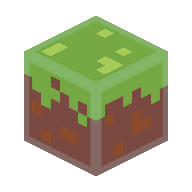

<p align="center">
  
</p>

# World Repair Studio

World Repair Studio is a usability-focused desktop tool for inspecting, selecting, copying, moving, exporting, and repairing chunks in Minecraft Java Edition worlds.

> **Fork and original-project credit:** World Repair Studio is an independent fork of [MCA Selector](https://github.com/Querz/mcaselector), created and maintained by [Querz](https://github.com/Querz). The underlying world-reading, chunk-editing, filtering, and rendering foundation comes from MCA Selector. This fork retains its MIT license and copyright notice.

## What this fork adds

- A modern, full-world editor with detached translucent controls.
- Fast world tabs for moving chunk selections between open worlds.
- A simplified isometric view built from real surface colors and terrain heights.
- A clear starting screen and safer, more readable confirmation dialogs.
- A workflow centered on repair, regeneration preparation, inspection, and world-to-world transfers.

## Safety

World Repair Studio can modify or delete Minecraft chunks. Always make a backup before editing an important world. Selection, inspection, copying, and the isometric view are non-destructive until an editing action is explicitly confirmed.

## Current release

World Repair Studio `1.0.0` is based on MCA Selector 2.8. The current packaged build targets Apple silicon macOS; the Java source remains cross-platform.

## Building locally

World Repair Studio requires JDK 21 with JavaFX.

```bash
./gradlew clean test
mkdir -p build/licenses
./installer/init . build/licenses/LICENSE
./gradlew jpackage
```

The packaged application is written to `build/jpackage`.

## License and attribution

World Repair Studio is distributed under the [MIT License](LICENSE).

- Original MCA Selector copyright © 2018–2026 Querz.
- World Repair Studio modifications copyright © 2026 Samuel Barron.
- Minecraft is a trademark of Microsoft. This project is not an official Minecraft product and is not approved by or associated with Mojang or Microsoft.
